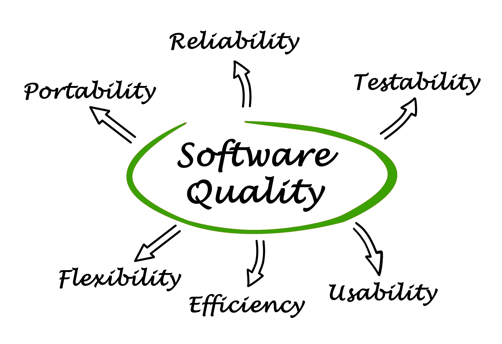
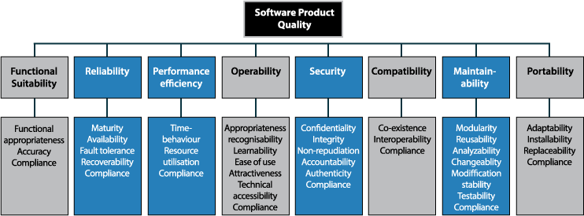
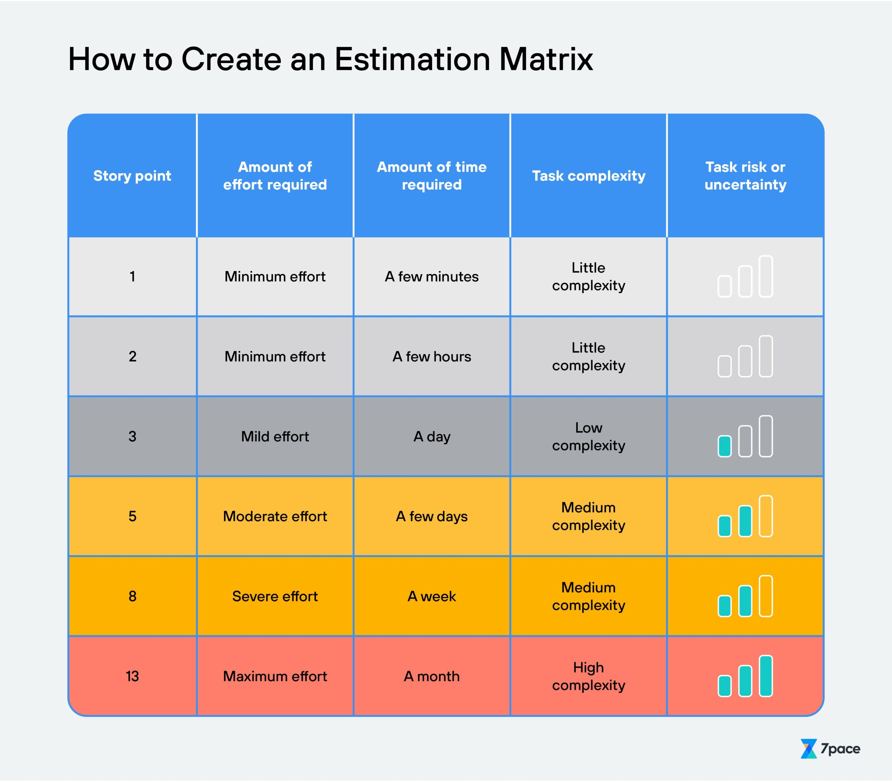
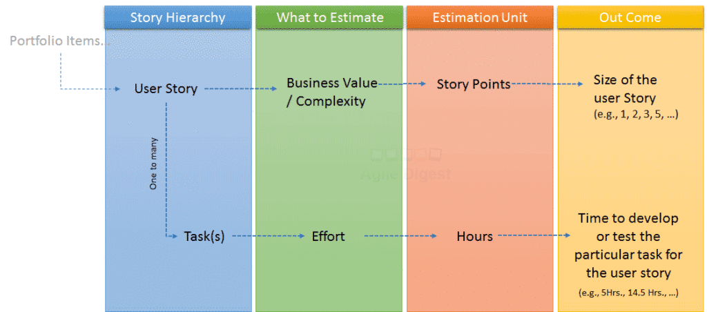
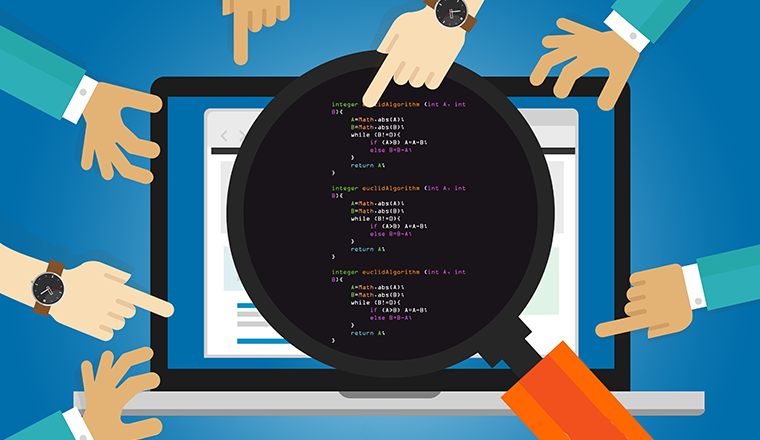
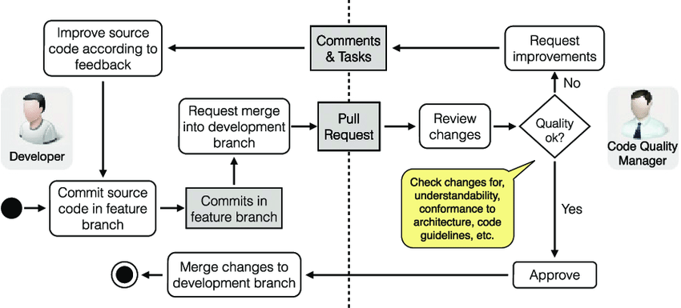
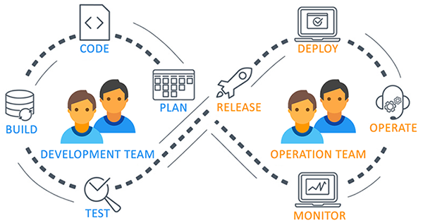
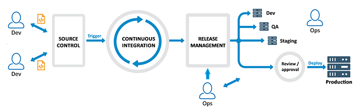

**Software Quality Handbook**

**Software Quality**

Software quality refers to the overall characteristics of developed software that make it fit for purpose, such as reliability,flexibility, usability, efficiency, testability, and protability. Software quality is determined by how well the software meets the requirements and needs of the users, and how well it performs in the intended environment. The software must meet customer or user needs and expectations.

**What is Software Quality Assurance**

Software quality assurance is the process that ensures that software products and services meet the required quality standards and customer expectations. Software quality is not just about lack of defects but also the presence of value. The aim of SQA is to improve the software development process to ensure that the software that is being developed meets the required quality standard. Rather than fixing problems when they occur, we aim to prevent theses problems happening in the development process.

**Importance of Software Quality Assurance**

- It is important to ensure customer satisfaction with the end product in the hopes that customers will continue to use the software and also recommend it to others.
- Preventing defects early in the development process reduces the cost of fixing them later. With solid SQA, you can catch these defects early before they become larger issues.
- Productivity is majorly improved when these issues are caught early, it can reduce the time spent and effort needed to fix the issues further down the lin.
- Reducing risk is a major benefit to high standard software quality. Bad software quality can lead to security breaches and loss in data. SQA helps prevent these risks.

ISO/IEC 25010 is a standard that provides a framework for software quality requirements and evaluation. It is attempt to define quality that provides guidelines for software development.

Take a look: 

**Our Goals**

 The goal of the handbook is to establish best practices for the team to follow and create a more consistent approach to software development.
 This handbook will cover the following three topics:

 1. Task Estimation In Scrum
 2. Code Reviews
 3. Dev Ops

 When in doubt of anything related to Software Quality, we advise Software Engineers to refer to our Software Quality Handbook.

 Lets Begin:
 

**Task Estimation In Scrum**

Firstly, lets talk about what task estimation in scrum actually is. Task estimation in scrum is an essential part of the planning process. Scrum is one of the most popular Agile Methodologies and planning and estimating the time these tasks will take to complete in the upcoming sprint is a key element to have quality software. Task estimation involves the development team coming together to have a scrum planning meeting which is a scheduled meeting where the team will come together to estimate the amount of time it will take to complete each item in the product backlog. The team will generally estimate time for each item in the backlog using story points which are based on the complexity, effort and any other factor that might be involved. 

I found a great article that articulates the challenges of task estimation but also the different techniques and strategies for successfull task estimation.

Challenges of Task estimation in Scrum: 

- Uncertainty
- Complexity
- Lack of information/Experience
- Time pressure
- Cognitive biases

Techniques:
 
 1. Planning Poker
 2. Affinity Estimation
 3. Triangulation
 4. Bottom-Up Estimation
 5. Wideband Delphi

 These are all very well know techniques. To read more on these techniques and challenges, take a look at the below article: 
 [Tips for Effective Task Estimation in Scrum Planning Meetings](https://liuhongbo.medium.com/tips-for-effective-task-estimation-in-scrum-planning-meetings-c7a6af2c4966)

 As listed in the above article, cognitive biases is a challenge related to task estimation. What is this? Cognitive Biases are mental shortcuts that influence are thinking and decision making. People tend to overestimate their abilities and underestimate the time required to complete a task. In an blog post by David Tzemach, he mentions ego being a big challenge with time estimation in scrum. He mentions his own experience within a scrum team and how you can come across "experts" who thinks they know best voiding others opinion. We do not want this. 

 Key takeaways:
 - Every team members opinion matters. 
 - Do not over estimate your abilities, give yourself some breathing room.
 - Do not underestimate the tasks at hand
 - Leave the ego at home! 

 [Challenges with Estimations in Agile projects | David Tzemach](https://www.agilequalitymadeeasy.com/post/challenges-with-estimations-in-agile-projects-david-tzemach)

 Following the above takeaways, I have found a very interesting forum that I would like to share. The question is raised that in this persons personal experience, her team only estimates stories, not estimating tasks and bugs, is this the best practice?. The reason i mention this forum is because of a specific reply from a Thomas Owens. He says "The only important opinion is that of the team" and that "Estimates aren't for use by stakeholders outside of the team". What I have taken from this is that if you think your team should/shouldnt be estimating certain factors like bugs/smaller tasks that dont effect the customer. Raise this in the scrum meeting. Task estimation is very situational. As you can see their is a common theme in this section of the handbook. "Every team members opinion matters". To ensure the highest level of software quality, factors even as small as adding in extra time in the estimation for bugs can go along way for successful, on time delivery of the software.

 [To read more on this forum and see other responses to the question raised](https://www.scrum.org/forum/scrum-forum/58252/should-we-estimate-our-tasks)

 Is It Worth Estimating the Tasks of Scrum Teams in Hours?

 As mentioned before, task estimation in scrum is generally measured in Story points. There are many benefits to this such as the evaluation being relative, taking into account risks and uncertainties in the requirements, the whole team takes part and the teams average speed is taken into account. But what about measuring these story points in man hours? 

 According to Artem Slepets who is a project manager at Mad Devs, there are many pros and cons to Task estimation in hours and he gives a great overview of this planning technique which allows for his team to deliver a quality software product. Here are the key points i took from this article: 

- Task estimation in hours is most beneficial when working in short sprints of 1-2 weeks where there is no need to use techniques such as the above mentioned "planning poker"
- Task estimation in hours rather than story points enables the team to more accurately set a deadline for the project completion before it even begins. 
- In Artems experience it is more effective to plan short projects of only 2-3 months. Reasoning: "If we're going to estimate tasks in story points at the beginning, we won't know how many of   them the team will be able to close in one sprint, so after doing 1-2 iterations, the estimate will have to be adjusted.

The reason this article is mentioned as it essential to get the timing of a project as accurate as possible. By estimating tasks correctly, the team can ensure that they have enough time and resources to complete each task to a high standard of quality. Use this article to fall back on when initially deciding how you are going to estimate tasks in the planning process. 

[Is It Worth Estimating the Tasks of Scrum Teams in Hours?](https://maddevs.io/blog/task-estimation-in-hours-for-scrum-teams/)

On the other hand, some prefer estimating in story points. Mike McEwen says he prefers story points to hours, "Story points are approximate and relative estimates that a team makes together about the effort required to complete a story." He then goes into detail about the best practices for Estimating Agile Projects With Story Points.

- Use non-consecutive point values
- Stabilize the team
- Get inputs from everyone
- Make informed estimates
- Make informed estimates

To read more on these practices, check out this article. 
[6 Best Practices for Estimating Agile Projects With Story Points](https://www.linkedin.com/pulse/6-best-practices-estimating-agile-projects-story-points-mike-mcewen/)

The reason I mention this article from Mike and also to conclude this section of the handbook, Is that Task estimation in scrum should not be a set and stone system you follow. Task estimation will differ depending on the project and also the team member and how they work best. For our team to have success and improve in the future on our task estimation, Refer to this section of our handbook.

**Code Reviews:**

- Code Review is a process where the complete code of a particular software application is dissected into smaller parts, then the parts are reviewed and analysed by senior developers and managers.
- It is a crucial part of the software development life cycle and allows developers to enhance code quality dramatically.
- Tracking errors and spotting early bugs is the main objective of Code Review, which also aims to maintain the cleanest source code possible.
- This process is an essential part of the DevOps cycle and is usually conducted before the QA testing.

**Why should you always Code Review?**

- Lets look at some of the advantages of Code Review:
- Early detection of bugs: Reviewing code aids detecting bugs early in the application development process. During the software development process, it is also cheaper to rectify issues in th earlier stages. As a result, code review decreases the overall cost of the software development process.
- Promotes agile development: Agile tesing requires on-time, high quality service delivery. Implementing the code review stage will assist in creating a high-quality product that is free of serious errors and complies with industry standards.
- Tutoring Newbies: If a junior developer has written the software development code, the senior managers should ultimately spend some time reviewing it and providing constructive feedback. The new employee will thus be familiar with the company's standards.
- Team building Activity: The code reviewing activity and feedback session are carried out by sharing information between the senior and junior employees. Employees can learn about their strenghts, areas for improvement etc. through the exchange of constructive criticism in this manner.

For more information about the importance of Code Reviews visit this link here: [How can code review help with quality assurance](https://www.browserstack.com/guide/code-review-for-quality-assurance#:~:text=Code%20Review%20is%20a%20process,in%20its%20cleanest%20possible%20state.)

**Code review problems:**

- Issues with code reviews can involve not telling the truth, Ego, wrong focus or even rushing it which eventually leads to inconsistencies.
- John Sonmez reveals based on her past experiences that the most effective code review approach is Paired Programming! Paired programming is like just-in-time code reviews. It resolves many of these issues by obtaining a common goal and creating a joint ownership in the code.

Overall the main points that I took from this article were that as you pair up with different members of your team:

1. You are likely to be more honest.
2. You will be less egotistical.
3. Main focus will be the problem itself and not conventions.
4. More analysis will be conducted in general and members can delve deeply into the code.

Use this article below if you want to find out how to implement effective paired programming in your teams:

[Don't snub the code review](https://simpleprogrammer.com/dont-snub-the-code-review/?utm_content=cmp-true)

**Code reviews best practices**

Kevin London not only goes into great details about code reviews in general but he also shares his own experiences with them and recommends tasks to be carried out for good code reviews.

The main points that I took from this article to implement good code review practice are:

- Ask Questions: How does this method work? If requirements changes, what else would have to change? How could we make this more maintainable?
- Compliment/reinforce good practices: One of the most crucial parts of code reviews is to reward developers for growth and effort.
- Discuss in person for more detailed points: If I'm discussing a point and it goes back and forth, I'll often pick it up in person and finish out the discussion.
- Explain reasoning: It's best to both ask if there's a better alternative and justify why I/he/she think it's worth fixing.
- Suggest importance of fixes: Clarifying if an item is important to fix before it can be considered done is useful for both the reviewer and the reviewee. It makes the results of a reviewer clear and actionable.

For more information about the handling of code reviews visit: 

[Code Review Best Practices](https://www.kevinlondon.com/2015/05/05/code-review-best-practices)

**How to run a Code Review?**

In a coding environment running code reviews and making sure everything has been properly reviewed can be a massive challenge.
In a blog by Richard Bellairs he goes through 5 essential tips to implement a successful code review which are:

- What to look for in a Code(Structure, Style, Performance, Test coverage and Design)
- Build and Test - Before Code Review
- Don't review code for longer than 60 minutes
- Check no more than 400 lines at a time
- Give feedback that helps(Not hurts)

For more information about this article visit:

[5 Essential code review practices ](https://www.perforce.com/blog/qac/9-best-practices-for-code-review)

**Approaches to Code Reviews**

In personal article Jason Cohen explains how only 1% of their code is inspected and how they want to increase it to 7% within the entire CTO.

The best approaches to code review are:

- Over the shoulder
- Email pass-around
- Paire programming 
- Tool-assisted 

For more information about what each of these approaches do use the below link to find out:

[Best code review approaches ](https://www.methodsandtools.com/archive/archive.php?id=66)

To conclude this section of the handbook it is essential that developers spend time to code review their work. Code review not only helps developers learn the code base but it helps both junior and senior developers learn new technologies and techniques for the future.

**Dev Ops**

**What is DevOps?**

DevOps which is known for Development and Operation's collaboration is a union of working products, working processes and working people.
The process of delivering applications and software services quickly and efficiently is accelerated by DevOps so that businesses can comprehend and adopt the market as soon as possible.
Additionally, it reduces the risk factor through continuous delivery and early feedback from stakeholders and end users.

**How DevOps works?**

Starting from design and development to testing automation and from continuous integration to continuous delivery, the team collaborates to accomplish the desired goal.
To respond rapidly to customer requests and address problems and bugs, people with both development and operations skill sets collaborate and use a variety of CI-CD and monitoring solutions.

**Benefits of DevOps**

Here are the following main benefits of DevOps practices:

- Break down the Silos: According to an article by Ankur Mistry he states that the most important benefit of employing DevOps is the ability of the cross-functional development team and operation team to collaborate, made possible by the self-organized working style.
- Speed: Faster in pace and multiple frequent deliveries of the desired updates and features will not only fulfill the requirement of the end users but will also assist your organization to take a firm stand in a competitve market.
- Reliability: By following DevOps best practices and using the best tool for continuous integration, testing automation, and continuous delivery and monitoring the logs helps the team to stay updated and take the real-time decision rapidly.
- Team Collaboration: DevOps enhances the collaborations between the Development team and operations team, team works together towards the specific business goal. DevOps break the silos and focuses on communication, transparency, inspection, adaption and integration.
- Risk Management: We can identify the risk factor utilizing this practice at an early stage of the application lifecycle. Staying ahead of the competition requires early detection of any problems or bugs and prompt repair or remedies.

For more information about DevOps in general and how they work please visit:

[DevOps introduction and how they work ](https://www.dotnettricks.com/learn/devops/what-is-devops-and-devops-advantages)

**Challenges to DevOps**

Nowadays many software and IT operations teams have adopted DevOps procedures into their work cultures to help them evolve into a quicker and more innovative version of theirselves.
Progress undoubtedly brings challenges and we will explore challenges to DevOps according to a blog by Ruchir Sanghavi.

- Overcoming the dev versus ops mentality: Understanding the roles and responsibilities of where dev stops and ops currently begins, and how these can best be integrated together, is a great starting point for any company and this is frequently the first obstacle a company has when adopting DevOps principles.
- Common understanding of continuous delivery practices: You need to ask yourself this as a developer, Do your feature teams really understand what it means to continuously deliver your software into environments and at a greater frequency?
- Implementing a test automation strategy: Development and operations teams need to ask themselves these questions:

1. How do we do data management for our tests?
2. Can we use open sourced shared libraries and common practices?
3. What does a good end to end test look like for our code base?
4. What should our smoke tests really do?

- Too much focus on tools: When implementing DevOps your team members are the most crucial component. Confusion will arise if they are not trained on the newly implemented tools and processes, which will hinder the adoption of the DevOps approaches.

If you would like to visit more challenges to DevOps within the technology industry please visit this link:

[DevOps Challenges](https://www.contino.io/insights/5-challenges-to-devops-adoption-and-how-to-overcome-them)

Keeping in mind that are goal is to develop quality software. Lets take a look at how DevOps can play an effect on the quality of our software. DevOps can have a significant impact on software quality. By automating the testing and deployment processes, DevOps helps us to ensure that the software is thoroughly tested and that any issues are identified and fixed as quickly as possible. Lets not forget to mention that DevOps teams generally use a continuous feedback loop to gather data on how software is performing in production which can then be used to improve software quality by identifying areas where there are performance issues, bugs, or other problems.

An Blog post by a Noam Kachko who is a software developer for 8+ years tells us how 1 year of DevOps experience changed her life as a developer.

1. Consider Automation
2. Write tests for continuous integration (CI)
3. Log messages wisely and connect the stack trace to Git
4. Get "concurrency aware"
5. Take care with dependencies

Above are her main practices she does differently after her experience in a DevOps team. This is exactly what we are looking for in a firm. Noam gives a great insight on how to put personal experience with DevOps into your life as a developer to improve software quality. It is very important to read this article: 

[Read more on Noams personal experience](https://techbeacon.com/app-dev-testing/how-one-year-devops-changed-my-life-developer)

Lets talk about how Software Quality effects DevOps. I found an article i thought put it perfect. "If DevOps methodology is the bridge between development and operations, QA is the support beam that makes it safe to cross". The goal of DevOps is to increase the speed, quality, and reliability of software delivery while reducing the time to market and the risk of production failures. Exactly what Quality Assurance is working towards. The link between the two is very important to understand. Here are three reasons why not to Underestimate The Role Of QA In DevOps 

1. A Fresh and Necessary Perspective on Builds
2. Faster Delivery with Parallel Testing
3. Testing Strategy Improvements

To read more on this: 

[Don't Underestimate The Role Of QA In DevOps For These 3 Reasons](https://www.copado.com/devops-hub/blog/dont-underestimate-the-role-of-qa-in-devops-for-these-3-reasons-crt)

The above article also mentions "DevOps should help eliminate misunderstandings between development and QA." DevOps is almost like a mindset that focuses on communication and collaboration between developers and testers. Another interesting article quotes similar "The very foundation of DevOps is built on eliminating barriers between developer and QA roles." The reason we chose to include DevOps in are Software Quality handbook as it is essential are team knows the relationship between the two to ensure the best quality software for our customers. This article goes into great detail on the relationship between the two. Please read:

[The Role of QA in DevOps](https://www.browserstack.com/guide/role-of-qa-in-devops)

**Conclusion**

To conclude our handbook, we want to ensure our developers and engineers have a solid understanding of Task estimation in scrum, Code Reviews and DevOps and the relation between the three to ensure that we as an organisation, deliver the best quality product to our customers. Software Quality refers to the the characteristics of the software. To ensure our software have the characteristics of a successful product, it is vital our team knows the ins and outs of the three topics covered in our handbook.
Code reviews have thought us that it can be extremely beneficial and enjoyable when done correctly using one of the appropriate techniques.
Task estimation helps our organisation with proper planning, management and estimation of the total efforts that will be utilised for implementing, testing and delivering the desired product to the end users in due time.
DevOps has proved to be an essential component because it is a software development and operations approach that enables rapid development of new products and easier maintenance of existing deployments.
